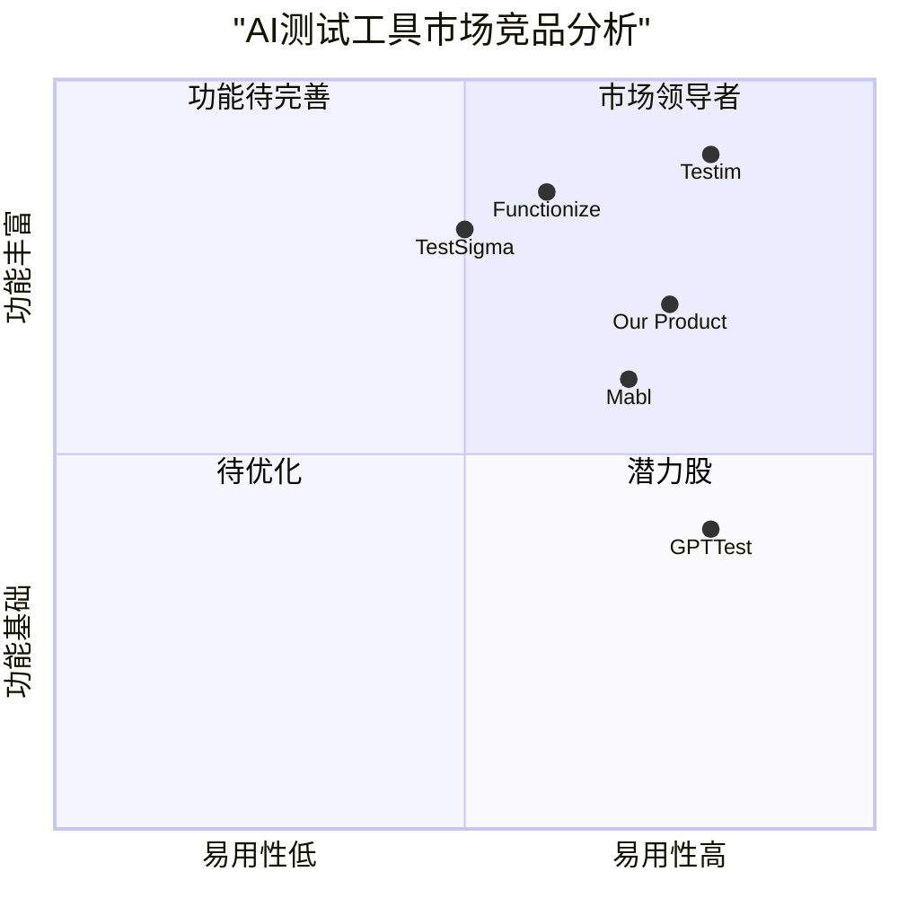

# AI软件测试员系统产品需求文档（PRD）

## 1. 项目信息

- 项目名称：ai_test_case_generator
- 编程语言：Python、React、JavaScript、Tailwind CSS
- 框架：AutoGen

### 1.1 项目背景

随着软件开发规模和复杂度的不断增加，传统的人工测试用例编写方法已经难以满足快速迭代的需求。通过AI技术，特别是大语言模型和多智能体系统，我们可以显著提升测试用例生成的效率和质量。本项目旨在开发一个基于AutoGen框架的智能测试用例生成系统，帮助测试团队更高效地完成测试工作。

### 1.2 原始需求

- 通过输入需求文档或文字信息进行需求分析
- 使用AutoGen框架实现多智能体系统
- 支持测试用例字段和格式的配置
- 生成的测试用例需要通过Excel输出

## 2. 产品定义

### 2.1 产品目标

1. 提升效率：将测试用例生成时间减少70%，显著提高测试团队的工作效率
2. 保证质量：通过AI智能分析，确保测试用例覆盖率达到90%以上
3. 标准化输出：实现测试用例的标准化和结构化，提升测试文档的整体质量

### 2.2 用户故事

1. 作为一名测试工程师，我希望能够上传需求文档，系统自动分析并生成相应的测试用例，以节省手动编写测试用例的时间
2. 作为测试经理，我希望能够自定义测试用例的输出格式和字段，以适应不同项目的测试规范要求
3. 作为开发团队成员，我希望能够通过简单的文字描述获取功能测试建议，以在开发阶段提前发现潜在问题
4. 作为质量保证主管，我希望能够查看和管理已生成的测试用例，并能够进行导出和共享

### 2.3 竞品分析

1. Testim
   - 优势：强大的AI学习能力，支持自动化测试
   - 劣势：价格较高，配置复杂

2. Mabl
   - 优势：简单易用，界面友好
   - 劣势：功能相对单一，不支持深度定制

3. TestSigma
   - 优势：支持多平台测试，无代码自动化
   - 劣势：学习曲线较陡，文档不完善

4. GPTTest
   - 优势：基于GPT模型，自然语言理解能力强
   - 劣势：缺乏多智能体协作，输出格式单一

5. Functionize
   - 优势：AI驱动的测试自动化，维护成本低
   - 劣势：企业级定价，对小团队不友好

### 2.4 竞品象限图

## 3. 技术规格

### 3.1 需求分析

#### 3.1.1 核心功能需求
1. 文档分析能力
   - 支持PDF、Word、Markdown等多种格式的需求文档输入
   - 支持直接输入文本描述
   - 自动提取关键功能点和测试要求

2. 多智能体系统
   - 基于AutoGen框架构建多个专业角色智能体
   - 包括需求分析师、测试设计师、质量审核员等角色
   - 实现智能体间的协作和交互

3. 测试用例生成
   - 支持功能测试、接口测试、性能测试等多种类型
   - 自动生成测试步骤和预期结果
   - 支持测试用例的优先级划分

4. 格式配置功能
   - 提供测试用例模板配置界面
   - 支持自定义字段添加和删除
   - 支持Excel格式的样式定制

#### 3.1.2 非功能需求
1. 性能要求
   - 文档分析响应时间<30秒
   - 测试用例生成时间<60秒/100条
   - 支持并发处理多个项目

2. 可用性要求
   - 提供Web界面操作
   - 操作流程不超过3步
   - 支持批量处理

3. 安全性要求
   - 数据传输加密
   - 用户权限管理
   - 敏感信息脱敏

### 3.2 需求池（优先级划分）

#### P0（必须实现）
1. 需求文档分析和关键信息提取
2. AutoGen多智能体系统框架搭建
3. 基础测试用例生成功能
4. Excel格式测试用例导出
5. 测试用例模板配置功能

#### P1（应该实现）
1. 测试用例质量评估
2. 多种文档格式支持
3. 批量处理功能
4. 用户权限管理
5. 项目管理功能

#### P2（可选实现）
1. 测试用例版本控制
2. 协作功能
3. 测试执行追踪
4. 数据统计和报表
5. API集成接口

### 3.3 UI设计草图

主界面布局将包含以下关键元素：
1. 左侧导航栏
   - 项目管理
   - 需求上传
   - 用例管理
   - 配置中心

2. 中央工作区
   - 文档预览/编辑区
   - 生成结果展示
   - 进度提示

3. 右侧配置面板
   - 模板选择
   - 字段配置
   - 导出选项

### 3.4 开放问题

1. AutoGen框架的具体智能体设计方案需要进一步细化
2. 测试用例生成的质量评估标准需要明确
3. 是否需要支持多语言测试用例生成
4. 私有化部署方案需要评估
5. 与现有测试管理工具的集成方案需要确定
